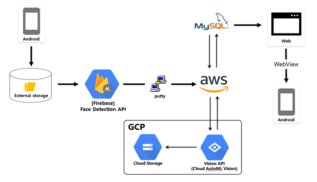
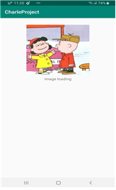
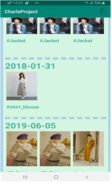

# Charle-sWithGCP

## Project Name
#### Charle-s project
* 시스템 구조도
  > 
   
* GCP를 이용한 이미지 분석 모델 설계 및 Android Application 구현
  + GCP를 이용한 이미지 분석 모델 구축  
  > + Google Cloud Platform의 AutoML Vision API를 통해 이미지 분류 모델을 생성한다.  
  > + 이 API는 사용자가 데이터와 클래스만 제공하면 이를 기반으로 한 분류 모델을 자동으로 만들어주는 서비스다.  
  > + 현재 프로젝트는 상의 종류를 판별하는 모델을 만들기 위해 약 700개의 이미지 데이터를 활용하였다.  
  > + 정제 과정을 거치지 않은 초기 모델을 사용하기 때문에 정확도가 높지 않다.  
  > + 형성된 모델은 RESTful API 형식으로 사용이 가능하며, JSON 형식으로 응답한다.  
  + [Firebase] Face Detection API  
  > + 이 API는 기기별 모델, 클라우드 모델과 같은 2가지 형태로 사용할 수 있으며 본 서비스는 기기별 모델을 채택하였다.  
  > + ALL_CLASSIFICATIONS 옵션을 통해 얼굴이 웃고 있는지, 눈을 뜨고 있는지와 같은 기준을 통해 인물 사진인지 판단한다.  
  + Android Application 구현  
  > + Application이 로딩하는 동안 Android device 내의 모든 사진을 불러온다.  
  > + Firebase가 제공하는 Face Detection API를 통해 갤러리의 사진 중 인물 사진만을 선별한다.  
  > + 선별된 이미지는 base64로 인코딩한다.  
  > + 인코딩 된 이미지는 이름, 날짜, 인코딩 값을 POST 방식으로 Web Server에 업로드한다.  
  > + 라벨링 과정을 거친 이미지들은 Web page에 나타나며, Android의 Web View를 통해 이미지들을 모바일로 확인할 수 있다.  
  + Web Server
  > + AWS를 사용하여 Web server를 구축하였다.  
  > + Android에서 데이터 업로드 시 내부 DB에 insert 하기 전에 이미지를 base64로 인코딩한 후 모델로 전송하는 역할을 한다.  
  > + 결과로 클래스를 받을 때 DB의 tag 속성으로 클래스 결과를 넣는다.  
  
### 프로젝트 기간
2019.03.01 - 2020.06.10
 

### Result
> 
> 
 
 

  
